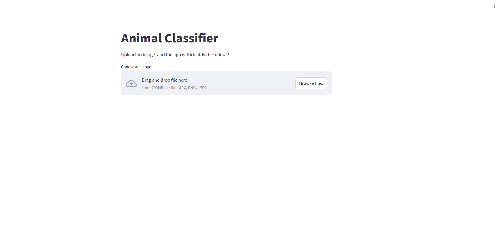
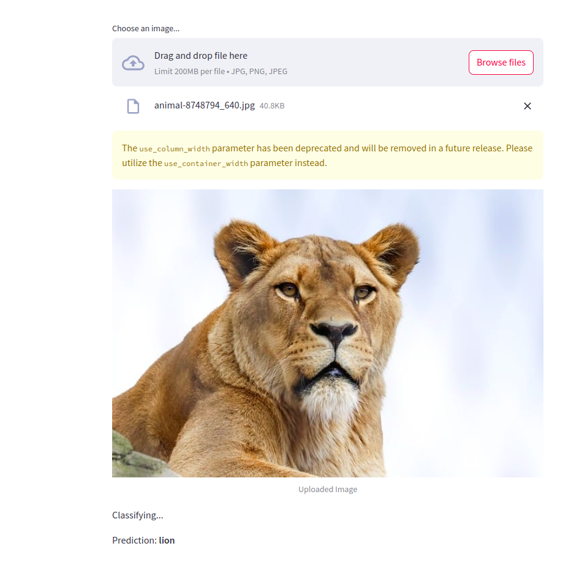

# Animal Classifier App 🐾

This is a **Streamlit web application** that allows users to upload an image of an animal and predicts the name of the animal using a **pre-trained MobileNetV2 model**. The app leverages the power of **TensorFlow** and **ImageNet**-trained weights to classify images.

---

## Features ✨

- 🖼️ **Upload Image**: Upload any `.jpg`, `.jpeg`, or `.png` file.
- 🧠 **AI-Powered Classification**: Uses MobileNetV2, a state-of-the-art pre-trained deep learning model.
- 🚀 **Real-time Results**: Provides instant predictions with a simple and intuitive interface.
- 🌐 **Web-Based**: Accessible from any device with a browser.

---

## Demo 🎥

> [Click here to try the app!](https://animal-classifier-app-talaatx.streamlit.app/)

---

## How It Works 🛠️

1. **Upload an Image**:
   - Drag and drop or browse to select an image of an animal.
2. **AI Processing**:
   - The app resizes and preprocesses the image to match the model's input format.
   - The MobileNetV2 model predicts the animal name based on the image.
3. **Get Results**:
   - The predicted animal name is displayed instantly on the screen.

---

## Installation & Usage 🖥️

### Prerequisites
- Python 3.8 or higher
- pip (Python package manager)

### 1. Clone the Repository
```bash
git clone https://github.com/talaatmagdyx/animal-classifier-app.git
cd animal-classifier-app
```

### 2. Install Dependencies
```bash
pip install -r requirements.txt
```

### 3. Run the App Locally
```bash
streamlit run animal_classifier_app.py
```

The app will run locally and can be accessed at `http://localhost:8501` in your browser.

---

## Deployment 🚀

### Streamlit Cloud
1. Push the code to your GitHub repository.
2. Log in to [Streamlit Cloud](https://streamlit.io/cloud) and deploy the app.

### Docker
1. Build the Docker image:
   ```bash
   docker build -t animal-classifier .
   ```
2. Run the Docker container:
   ```bash
   docker run -p 8501:8501 animal-classifier
   ```

The app will be accessible at `http://localhost:8501`.

---

## File Structure 📂

```plaintext
animal-classifier-app/
│
├── animal_classifier_app.py   # Main Streamlit app code
├── requirements.txt           # List of dependencies
├── Dockerfile                 # For containerization (optional)
└── README.md                  # Documentation file
```

---

## Dependencies 📦

- **Streamlit**: For building the web app.
- **TensorFlow**: For using the pre-trained MobileNetV2 model.
- **Pillow**: For image processing.

---

## Screenshots 📸

### Upload Image


### Prediction Output


---

## Future Improvements 🚧

- Fine-tune the model with an animal-specific dataset for better accuracy.
- Add support for identifying multiple animals in a single image.
- Enable multilingual support in the app interface.

---

## Contributing 🤝

Contributions are welcome! Feel free to submit a pull request or open an issue for bug fixes, enhancements, or suggestions.

---

## License 📜

This project is licensed under the [MIT License](LICENSE).

---
Feel free to reach out with any questions or suggestions!

